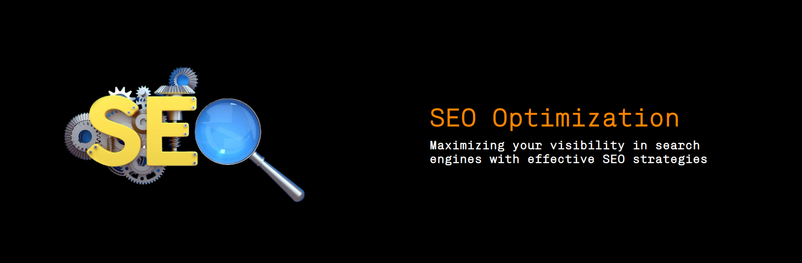

# Moshe Gadol

## Freelance Web Developer Portfolio

### This site features my portfolio, and tells you about the services I offer

#### You can visit the live site here [Gadol.dev](https://gadol.dev) and the github repo here [https://github.com/Moshe-jpg/moshe-portfolio](https://github.com/Moshe-jpg/moshe-portfolio)

#### I built this site using a React.js framework, and utilized tools such as Email.js, GSAP, and CSS to make this a truly awesome website.

## Check it out

